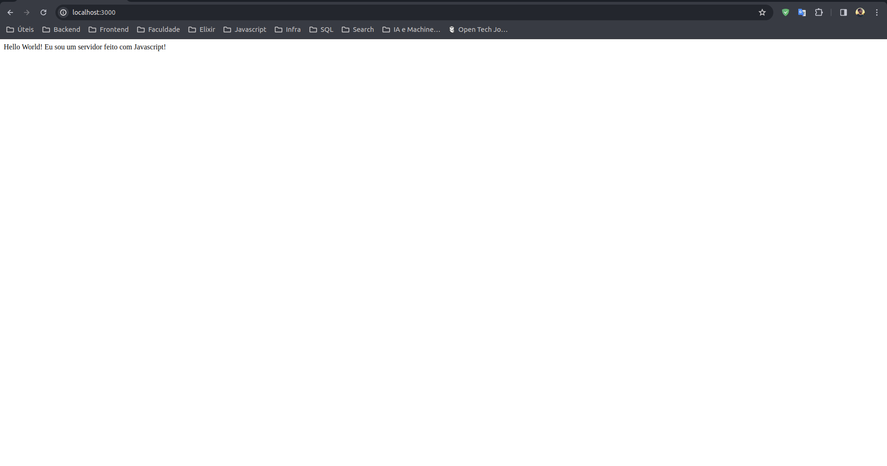

## Fluxo de informação

1. usuário acessa a porta 3000

2. o docker manda tudo pra porta 80

3. o nginx decide para qual réplica mandar a requisição

## Aplicação

Esse projeto roda um load balancer (balanceador de carga) com Nginx e NodeJS (Javascript).
O app em Javascript simplesmente responde com uma mensagem de texto simples. 4 réplicas desse mesmo app são executadas. Utilizei o docker compose para orquestrar os containers e rodar tudo automaticamente.

## Como executar

Você vai precisar do docker e docker compose instalados na máquina.
Depois de clonar o projeto na sua máquina, entre na pasta `docker` e execute o seguinte comando:

```bash
docker compose up --build
```

Agora acesse `http://localhost:3000` e você deve ver essa tela:



## Links para estudo

https://www.hostgator.com.br/blog/load-balance-o-que-e-e-como-implementar/
https://www.nginx.com/

